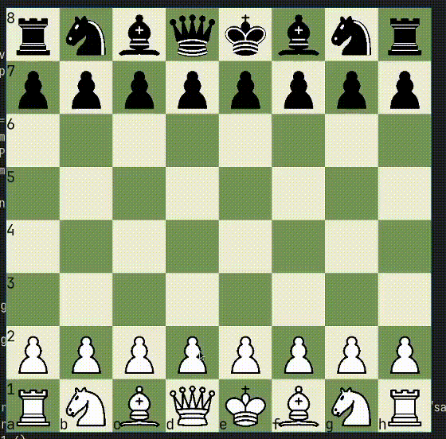

# Šah - pygame

Jednostavan šah u python-u pomoću pygame modula.



**WIP!**

## Pokretanje:

Za pokretanje je potrebno imati instaliran [python](https://www.python.org/downloads/) i [pygame](https://www.pygame.org/news).
```console
$ pip install pygame
```

Pokretanje:

```console
$ git clone https://github.com/Eugen-str/sah-pygame.git
$ cd sah-pygame/src
$ python Main.py
```